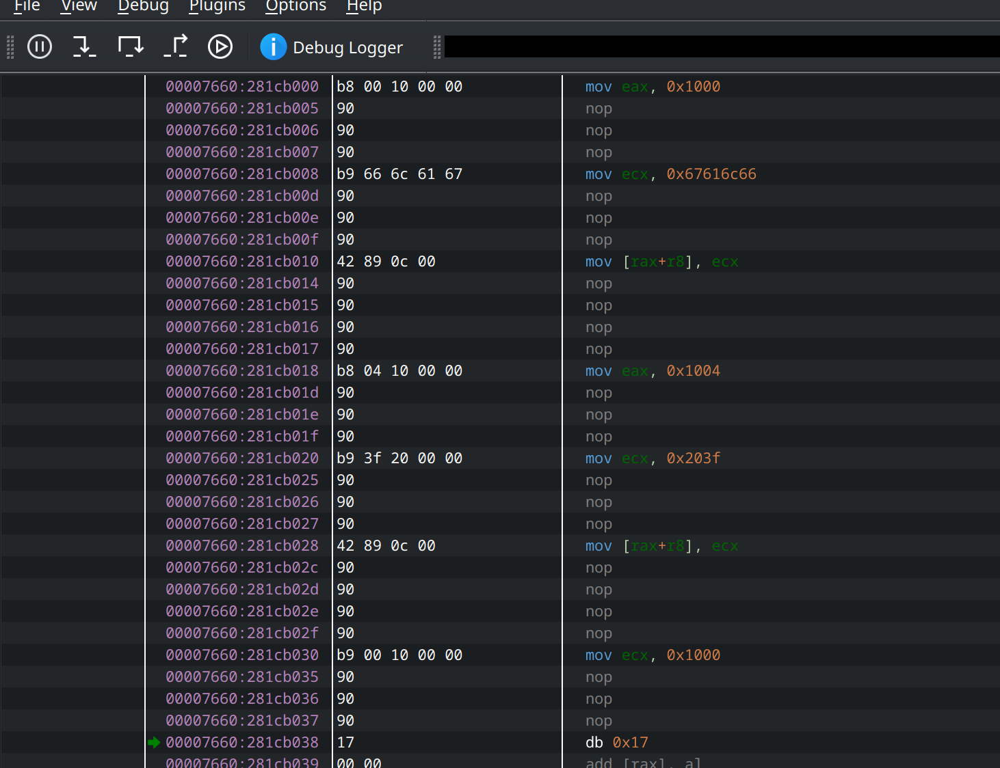

# Now This Will Run on My 486?

**Challenge**: *From [IrisCTF 2025](https://ctftime.org/event/2503) in the “easy” category.*

## Challenge Description

> It’s the future, which means tons of new CPU extensions! Unfortunately, we’re using such bleeding-edge technology that your computer probably doesn’t support it.
>
> Thankfully, with our proprietary JIT compiler, you can run it even on your 486!

We’re given an archive containing a binary named `main`. When run, it prompts for a flag, then prints:

```
Program returned "incorrect" (1).
```

…and exits.

## Initial Analysis

Let’s open `main` in [Binary Ninja](https://binary.ninja/) to see what it’s up to. The decompiled `main()` function looks roughly like this:

```c
int32_t main(int32_t argc, char** argv, char** envp)
{
    void* fsbase;
    int64_t rax = *(uint64_t*)((char*)fsbase + 0x28);
    int32_t var_3b0 = 4;
    int64_t (* act)(int64_t arg1, int64_t arg2, void* arg3) = sub_12c8;
    sigaction(4, &act, nullptr);
    void var_398;
    char* rsi_1;
    char* rdi;
    rdi = __builtin_memcpy(&var_398, &data_2218, 0x378);
    *(uint8_t*)rdi = *(uint8_t*)rsi_1;
    data_4028 = 0x379;
    int64_t rax_2 = mmap(nullptr, 0x379, 0x3, 0x22, 0xffffffff, 0);
    data_4030 = rax_2;
    int32_t result = 1;
    
    if (rax_2 != -1)
    {
        int64_t rax_3 = mmap(nullptr, data_4010, 0x3, 0x22, 0xffffffff, 0);
        data_4020 = rax_3;
        
        if (rax_3 != -1)
        {
            memcpy(data_4030, &var_398, data_4028);
            
            if (mprotect(data_4030, data_4028, 0x5) == 0xffffffff)
                result = 1;
            else if (mprotect(data_4020, data_4010, 0x3) == 0xffffffff)
                result = 1;
            else
            {
                int32_t result_1 = data_4030(0, 0, 0, 0, data_4020);
                result = result_1;
                
                if (result_1)
                    __printf_chk(1, "Program returned \"incorrect\" (%d…", (uint64_t)result_1);
                else
                    puts("Program returned \"correct\"!");
                
                munmap(data_4030, data_4028);
                munmap(data_4020, data_4010);
            }
        }
    }
    
    if (rax == *(uint64_t*)((char*)fsbase + 0x28))
        return result;
    
    __stack_chk_fail();
    /* no return */
}
```

This code copies some data into an `mmap`-ed region, modifies the memory protection to make it executable, and calls it like a function. The program passes four zeros plus another `mmap`-ed buffer to that function. The function is supposed to return 0 if the flag is correct, otherwise it returns nonzero. But the actual bytes at that memory region look like gibberish:

```hexdump
00002218  data_2218:
00002218                          17 00 00 00 10 00 00 00          ........
00002220  17 01 00 66 6c 61 67 00 c5 01 00 00 00 00 00 00  ...flag.........
00002230  17 00 00 04 10 00 00 00 17 01 00 3f 20 00 00 00  ...........? ...
...
```

Nevertheless, we can spot the string `flag` and `?`, so it’s likely not encrypted. A more suspicious line appears near the top of `main()`:

```c
int64_t (* act)(int64_t arg1, int64_t arg2, void* arg3) = sub_12c8;
sigaction(4, &act, nullptr);
```

Here, the program sets a signal handler for signal number 4 (`SIGILL`), triggered on illegal instructions. The code is probably patching instructions at runtime, which is confirmed by `sub_12c8`:

```c
int64_t sub_12c8(int64_t arg1, int64_t arg2, void* arg3)
{
    char* rbp = *(uint64_t*)((char*)arg3 + 0xa8);
    char rbx = *(uint8_t*)rbp;
    sub_1260();
    
    if (rbx > 0x62)
    {
        if (rbx <= 0xea)
        {
            if (rbx <= 0xc3)
            {
                if (rbx == 0x82)
                {
                    int32_t rax_30 = (*(uint32_t*)(rbp + 3) << 3) + (int32_t)data_4030 - (rbp + 5);
                    *(uint8_t*)rbp = 0xe9;
                    *(uint32_t*)(rbp + 1) = rax_30;
                    rbp[5] = 0x90;
                    *(uint16_t*)(rbp + 6) = 0x9090;
                }
                else if (rbx == 0x9a)
                {
                    int32_t rbx_8 = (*(uint32_t*)(rbp + 3) << 3) + (int32_t)data_4030 - (rbp + 8);
                    *(uint8_t*)rbp = 0x85;
                    uint32_t rdi = (uint32_t)rbp[1];
                    rbp[1] = sub_1249(rdi, rdi);
                    *(uint16_t*)(rbp + 2) = 0x840f;
                    *(uint32_t*)(rbp + 4) = rbx_8;
                }
            }
            // ...similar transformations...
        }
    }
}
```

This routine interprets certain bytes as instructions for a JIT compiler. Essentially, it’s converting the custom bytecode into real x86_64 opcodes at runtime.

### Two Approaches

1. **Reverse Engineer the Bytecode**  
   Build a full disassembler for this custom JIT format to figure out what the code does.

2. **Dump the Final Machine Code**  
   Let the program generate the machine code, then dump it from memory. This approach is much simpler if you have a debugger that can run and re-run the code easily.

### Dumping the Code via Debugger

I used [edb debugger](https://github.com/eteran/edb-debugger) because it’s straightforward to handle breakpoints and memory dumps. Here’s the process:

1. **Run the Binary** – Initially, the JIT routine triggers `SIGILL`, stopping at the newly `mmap`ed region with lots of `db` instructions:
   
2. **Pass the Signal** – Press "Run (Pass Signal to Application)" repeatedly to allow the JIT handler to replace some bytecode with valid opcodes.
3. **Re-examine Memory** – Watch the code region in the debugger morph from raw `db` placeholders into real x86_64:
    
4. **Repeat** – The program still returns "incorrect" eventually, but by resetting RIP after each return and continuing execution, you can fully generate all machine code.
5. **Dump the Final Code** – Once you see the code is fully patched, save that memory region to a file.

### Decompiling the Final Code

Loading the dumped code back into Binary Ninja yields:

```c
int64_t sub_0(int64_t arg1, int64_t arg2, int64_t arg3, int64_t arg4, int64_t memory)
{
    *(uint32_t*)(0x1000 + memory) = 0x67616c66;      // "flag"
    *(uint32_t*)(0x1004 + memory) = 0x203f;          // "? "
    int64_t r8_1 = syscall(0, 0x2000 + syscall(1, 0x1000 + memory, 6, 0x1000), 0x20, 0x2000);
    int32_t rdx = 0;
    int32_t rbx = 0x1f;
    
    while (true)
    {
        rdx += (uint32_t)(uint8_t)*(uint32_t*)((uint64_t)(0x2000 + rbx) + r8_1);
        
        if (!rbx)
            break;
        
        rbx -= 1;
    }
    
    if (0xcff != rdx)
        return 1;
    
    if (0xcc38c2be != (0xbf51b0d7 ^ *(uint32_t*)(0x2000 + r8_1)))
        return 2;
    if (0xeaa2018 != (0x75cc547b ^ *(uint32_t*)(0x2004 + r8_1)))
        return 3;
    if (0x1078b74d != (0x4f0fd83a ^ *(uint32_t*)(0x2008 + r8_1)))
        return 4;
    if (0xdb631232 != (0xa2117744 ^ *(uint32_t*)(0x200c + r8_1)))
        return 5;
    if (0x98a0a199 != (0xecd0cec6 ^ *(uint32_t*)(0x2010 + r8_1)))
        return 6;
    if (0x42789493 != (0x2e19f9fa ^ *(uint32_t*)(0x2014 + r8_1)))
        return 7;
    if (0x5685e086 != (0x32ea83d9 ^ *(uint32_t*)(0x2018 + r8_1)))
        return 8;
    
    if (!(0x98ca4085 != (0xe5eb61e0 ^ *(uint32_t*)(0x201c + r8_1))))
        return 0;
    
    return 9;
}
```

From `main()`, we know the final parameter is a memory region, so I renamed it to `memory` for clarity. This code does two syscalls (for writing "flag?" and reading input), then compares certain XORed values in memory. If they match, it returns 0 ("correct"); otherwise, it returns nonzero.

### Reversing the XORs

Let’s invert those XORs to see the hidden string. A quick Python snippet does the trick:

```python
def num_to_str(n):
    return bytes.fromhex(hex(n)[2:])[::-1].decode('utf-8')

vals = [
    (0xcc38c2be, 0xbf51b0d7),
    (0xeaa2018,  0x75cc547b),
    (0x1078b74d, 0x4f0fd83a),
    (0xdb631232, 0xa2117744),
    (0x98a0a199, 0xecd0cec6),
    (0x42789493, 0x2e19f9fa),
    (0x5685e086, 0x32ea83d9),
    (0x98ca4085, 0xe5eb61e0)
]
flag = ""
for a, b in vals:
    flag += num_to_str(a ^ b)

print(flag)
```

### Final Flag

Running the above code reveals the flag:

```
irisctf{wow_very_optimal_code!!}
```
